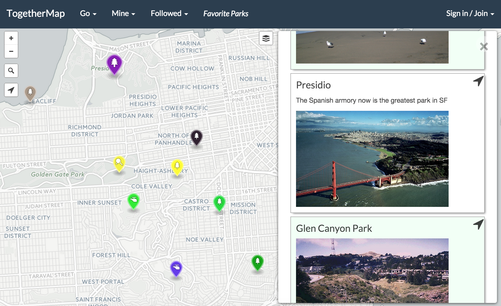
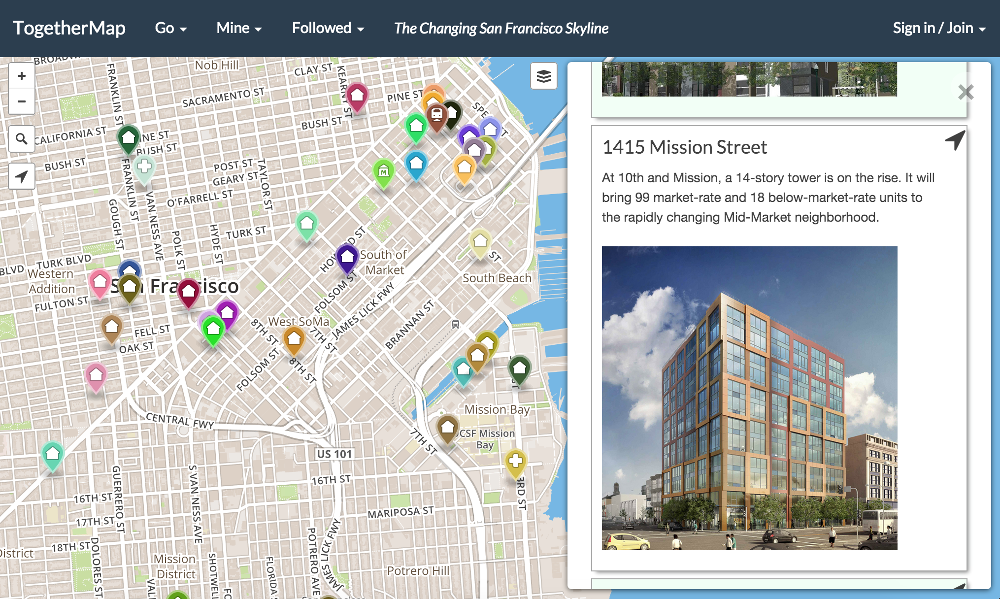
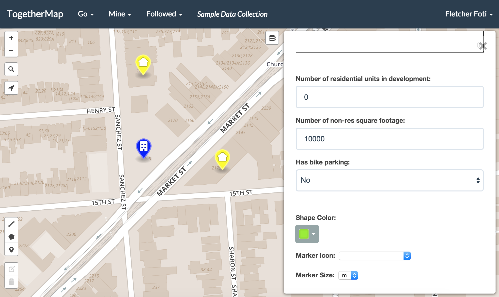
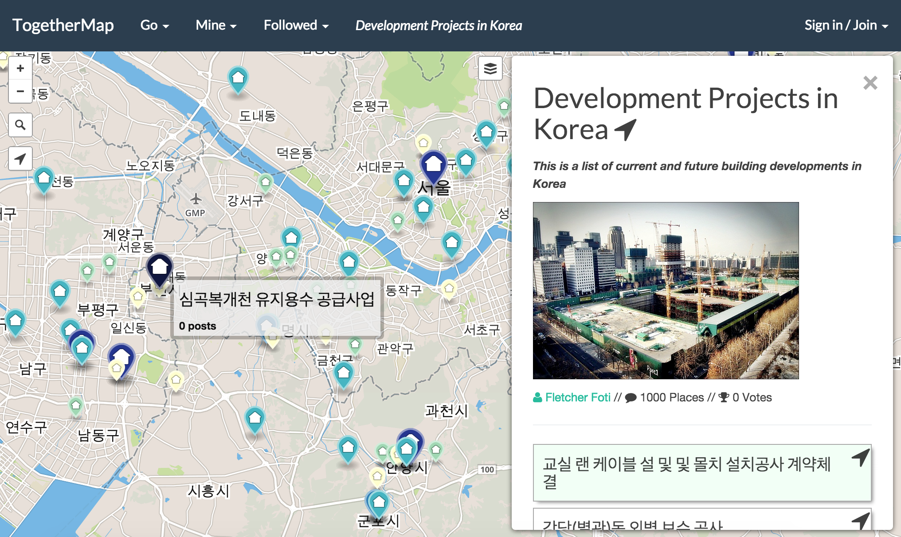

# TogetherMap: Collaborative Mapping for Web and Mobile

## The Name

*What does TM mean?*

TM is shorthand for TogetherMap.  TM brings mapping and spatial data into a modern web and mobile app, which enables you to reach more users and to reach users in a more collaborative way.  If you think of shapefiles-meets-google-docs you have the right idea.

## Mission

*What is the purpose of TM?*

Generally, our mission is to provide an app for people to participate in the change that's happening in their communities; ways we think this might happen are through data collection or chat associated with places.  Along the way we realized we were building a pretty useful multi-user environment for data collection and spatial data visualization, so we'll try out a few things and see what sticks.  Example use cases are up next.

## Examples

#### Simple collections of places, like saving your favorite parks.

 

#### Loading scraped web data of recent condo developments in San Francisco and talking about them.

 

#### Collecting data about places using simple web forms.

 

#### Worldwide use, like this collection of condo developments in Korea.

 

#### Custom theming and filtering of spatial data, and the ability for the user to switch themes and filters in order to explore spatial data.

