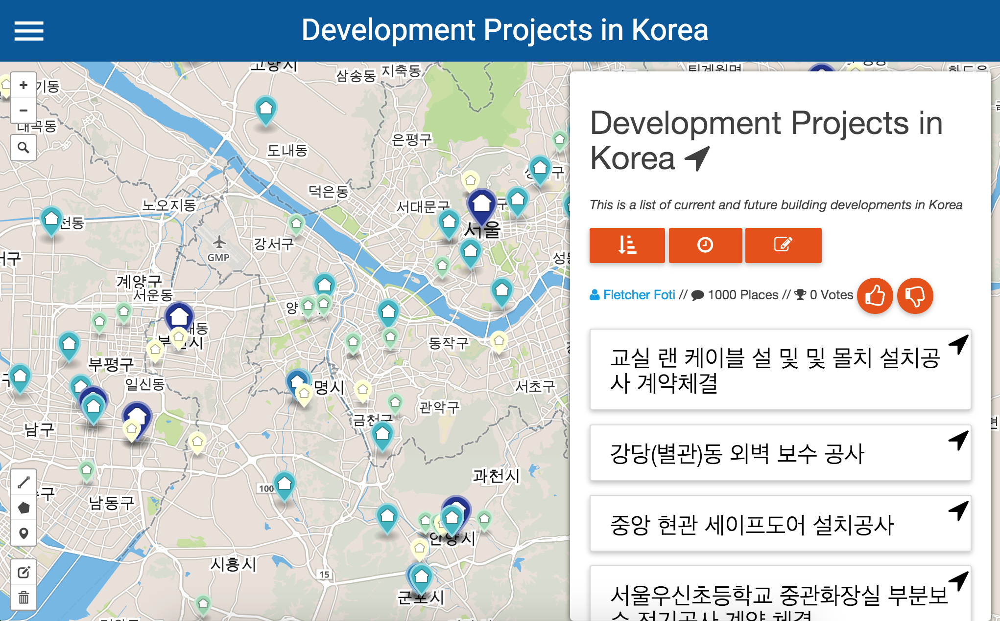
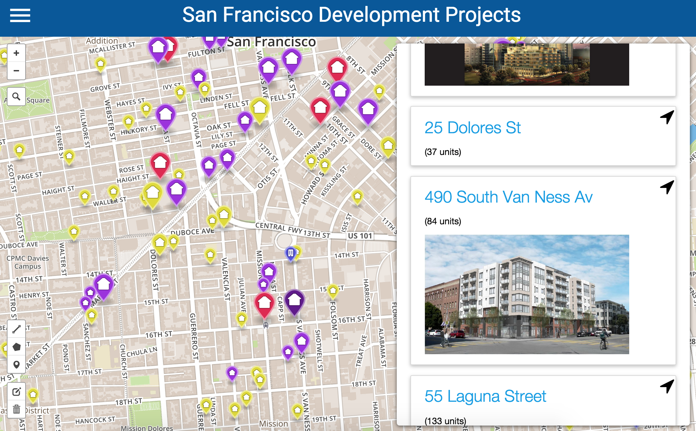

# TogetherMap: Collaborative Mapping for Web and Mobile

## The Name

*What does TM mean?*

TM is shorthand for TogetherMap.  With TM you can make maps collaboratively.

## Mission

*What is the purpose of TM?*

Generally, our mission is to provide an app for people to talk about what's happening in their communities.  Along the way we realized we were building a pretty useful multi-user environment for place collecting, map making, and data collection, so we're going to try out a few things and see what sticks.  Example use cases are up next.

## Examples

#### Simple collections of places, like saving your favorite parks.

 

#### Loading scraped web data of recent condo developments in San Francisco and talking about them.

 

#### Importing pictures of places from other websites.

 

#### Collecting data about places using web forms.

 

#### International use cases, like this collection of condo developments in Korea.

 

#### Custom theming of spatial data.

